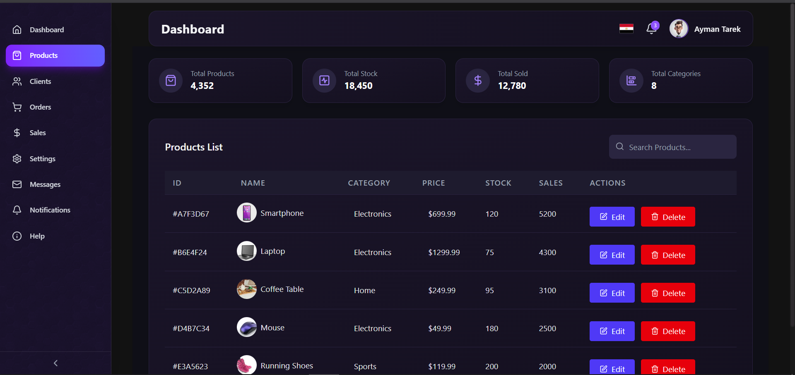
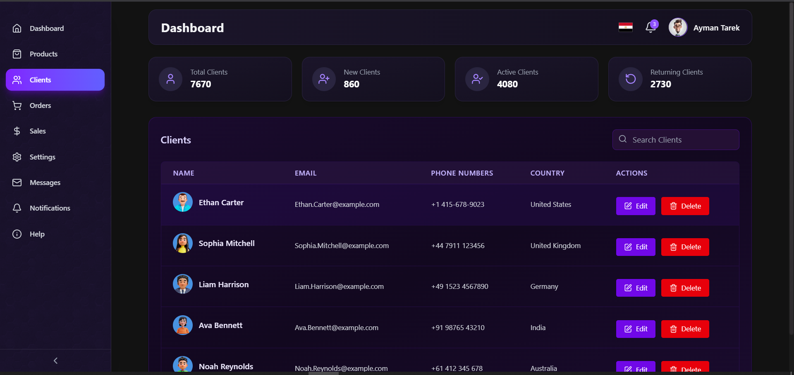
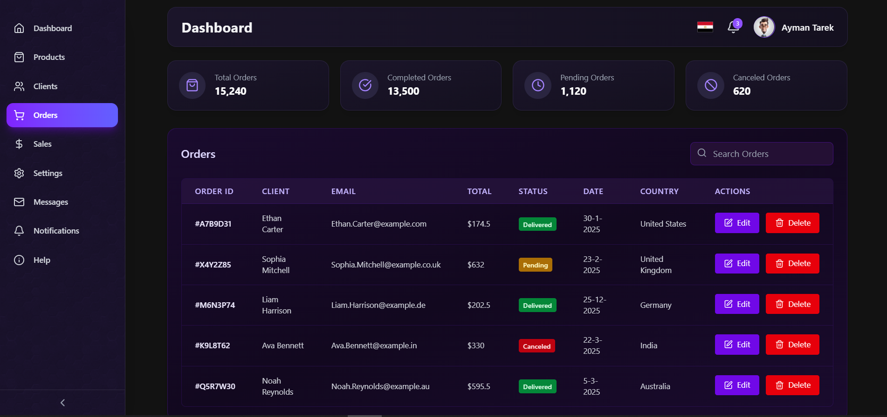
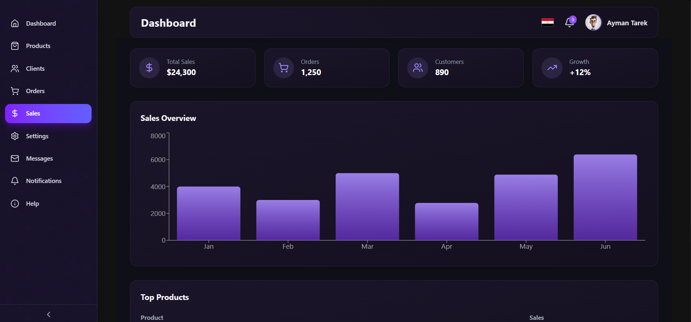
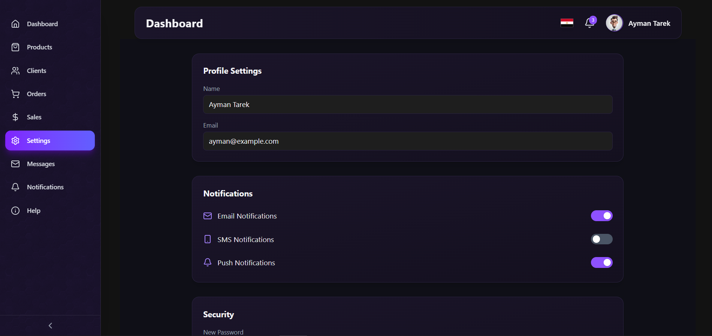
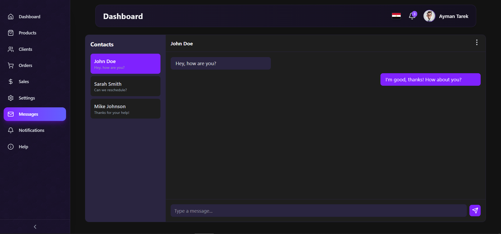
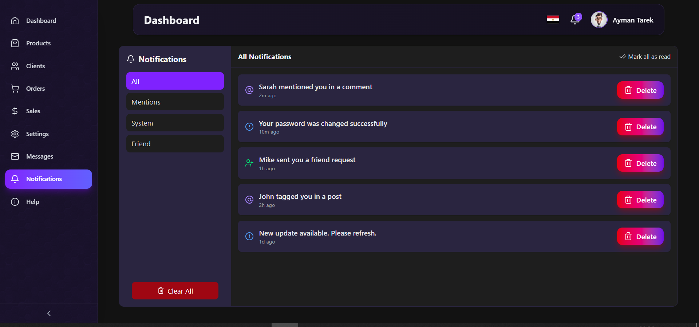
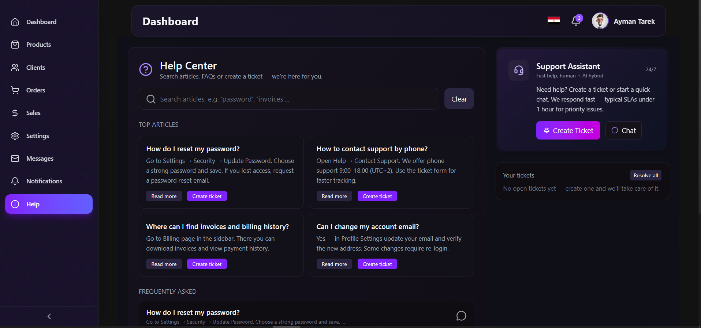

# 📊 Business Sales Dashboard

A **modern sales management dashboard** built with [Next.js 15](https://nextjs.org/) and [React 19](https://react.dev/).  
This project provides an elegant and interactive UI for managing **clients, orders, products, sales, notifications, messages, and settings** — all in one place.  

---

## ✨ Features
- 👥 **Clients Management** – View and manage customer data.  
- 📦 **Orders & Products** – Track orders and manage product inventory.  
- 💹 **Sales Analytics** – Interactive charts and statistics using Recharts.  
- 🔔 **Notifications System** – Stay updated with alerts and messages.  
- ⚙️ **Settings Panel** – Fully customizable dashboard experience.  
- 🎨 **Modern UI/UX** – Built with Tailwind CSS 4 + Framer Motion animations.  
- 🖼️ **Lucide Icons** – Clean and consistent icon set.  

---

## 🛠️ Tech Stack
- ⚡ [Next.js 15 + Turbopack](https://nextjs.org/)  
- ⚛️ [React 19](https://react.dev/)  
- 🎨 [Tailwind CSS 4](https://tailwindcss.com/)  
- 🌀 [Framer Motion](https://www.framer.com/motion/)  
- 📊 [Recharts](https://recharts.org/en-US/)  
- 🔗 [Lucide React](https://lucide.dev/)  

---

## 📸 Screenshots

### 📊 Dashboard  


### 🛒 Products  


### 👥 Clients  


### 📦 Orders  


### 💹 Sales  


### ⚙️ Settings  


### 💬 Messages  


### 🔔 Notifications  



### ❓ Help  



---

## 🚀 Getting Started

### 1️⃣ Clone the repository
```bash
git clone https://github.com/username/business-sales-dashboard.git
cd business-sales-dashboard
npm install
npm run dev
